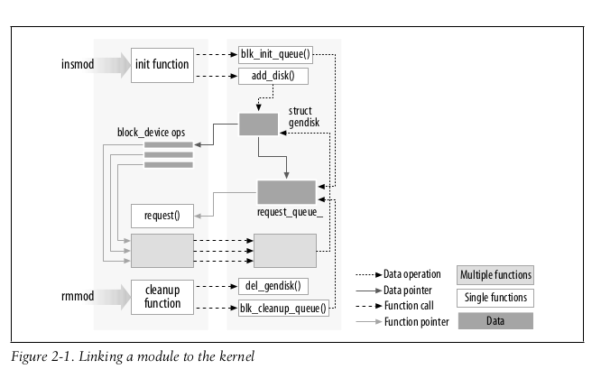

# Linux Driver Development
<sub>Reference: Linux Device Drivers, Third Edition, Jonathan Gorbet, Alessandro Rubini, and Grey Kroah-Hartman</sub>

# Class of Devices and Modules
There three fundamental devices types in Linux.
1. <details><summary>Char Module</summary>A character (char) device is one that can be accessed as a stream of bytes (like afile); a char driver is in charge of implementing this behavior. Such a driver usu-ally implements at least the open, close, read, and write system calls. The text console (/dev/console) and the serial ports (/dev/ttyS0 and friends) are examples of char devices, as they are well represented by the stream abstraction. Char devices are accessed by means of filesystem nodes, such as /dev/tty1 and /dev/lp0. The only relevant difference between a char device and a regular file is that you can always move back and forth in the regular file, whereas most char devices are just data channels, which you can only access sequentially. There exist, nonetheless, char devices that look like data areas, and you can move back and forth in them; for instance, this usually applies to frame grabbers, where the applications can access the whole acquired image using mmap or lseek.
</details>


2. <details><summary>Block module</summary>Like char devices, block devices are accessed by filesystem nodes in the /dev directory. A block device is a device (e.g., a disk) that can host a filesystem. In most Unix systems, a block device can only handle I/O operations that transfer one or more whole blocks, which are usually 512 bytes (or a larger power of two) bytes in length. Linux, instead, allows the application to read and write a block device like a char device—it permits the transfer of any number of bytes at a time. As a result, block and char devices differ only in the way data is managed internally by the kernel, and thus in the kernel/driver software interface. Like a char device, each block device is accessed through a filesystem node, and the dif- ference between them is transparent to the user. Block drivers have a completely different interface to the kernel than char drivers. </details>

3. <details><summary>Network module</summary>Any network transaction is made through an interface, that is, a device that is able to exchange data with other hosts. Usually, an interface is a hardware device, but it might also be a pure software device, like the loopback interface. A network interface is in charge of sending and receiving data packets, driven by the network subsystem of the kernel, without knowing how individual transac- tions map to the actual packets being transmitted. Many network connections (especially those using TCP) are stream-oriented, but network devices are, usu- ally, designed around the transmission and receipt of packets. A network driver knows nothing about individual connections; it only handles packets. Not being a stream-oriented device, a network interface isn’t easily mapped to a node in the filesystem, as /dev/tty1 is. The Unix way to provide access to inter- faces is still by assigning a unique name to them (such as eth0), but that name doesn’t have a corresponding entry in the filesystem. Communication between the kernel and a network device driver is completely different from that used with char and block drivers. Instead of read and write, the kernel calls functions related to packet transmission.</details>

)

# Basics
## Hello World Linux driver ( accessing the pid )

```c
#include <linux/init.h>
#include <linux/module.h>
#include <asm/current.h> // used to get the PID
MODULE_LICENSE("Dual BSD/GPL");
static int hello_init(void)
{
    // EX: 1 Printing Hello World
    printk(KERN_ALERT "Hello, world\n");

    // Ex: 2 THe current is defined in asm/current.h, which gives the pid
    printk(KERN_INFO "The Process is \"%s\" (pid %i)\n", current->comm, current->pid);
    return 0;
}
static void hello_exit(void)
{
    printk(KERN_ALERT "Goodbye, cruel world\n");
}
module_init(hello_init);
module_exit(hello_exit);
```
## linking a module to kernel


# Key Points
* As a programmer, you know that an application can call functions it doesn’t define: the linking stage resolves external references using the appropriate library of func- tions. printf is one of those callable functions and is defined in libc. **A module, on the other hand, is linked only to the kernel, and the only functions it can call are the ones exported by the kernel; there are no libraries to link to.** (pg no: 18)
* A module runs in kernel space, whereas applications run in user space. This concept is at the base of operating systems theory.


# File Information
1. `Documentation/kbuild`: To understand the comiling
2. `Documentation/Changes`: List the Required Tools
3. `/proc/modules` or `/sys/modules`: lsmod infos...
4. ``vermagic.o'`` : Before locading the module, kernel use this file to check wheter the modules is suitable for kernel.
5. `/var/log/messages`: you can read the info from here when some proble occurs