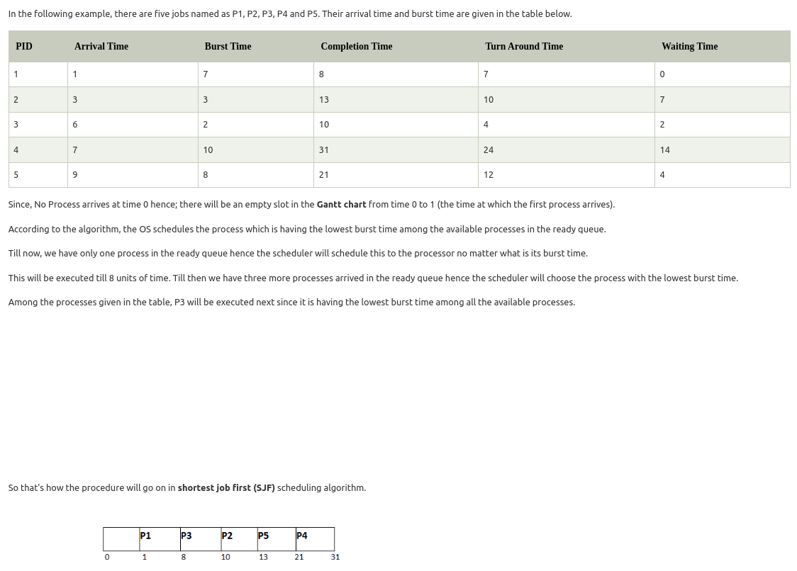
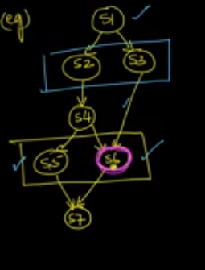
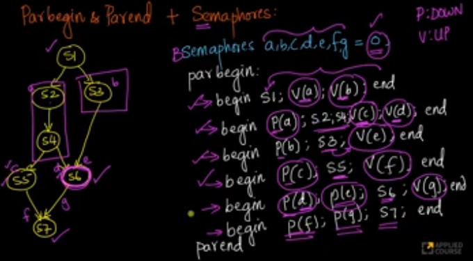
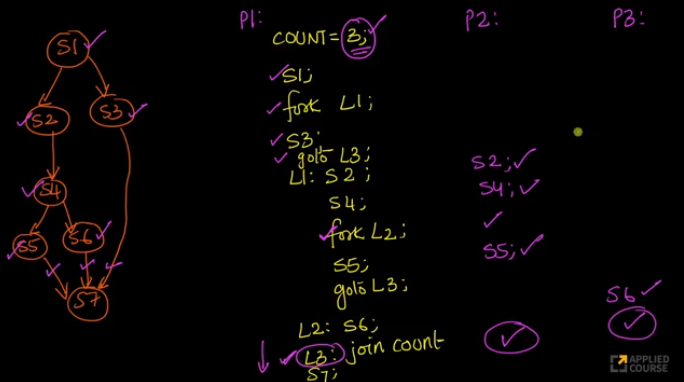
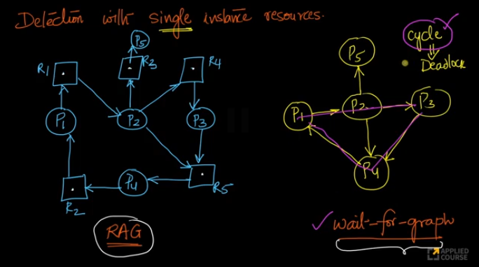
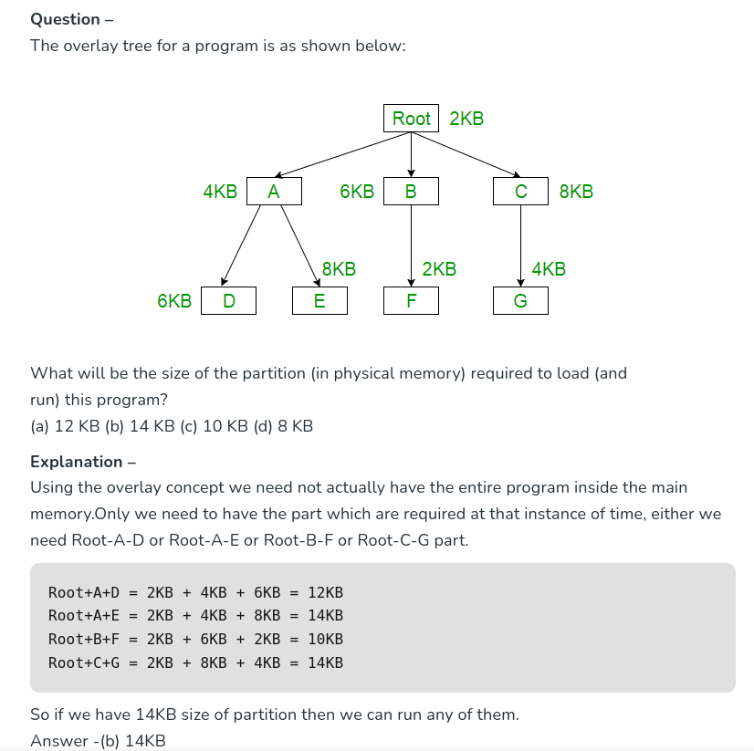
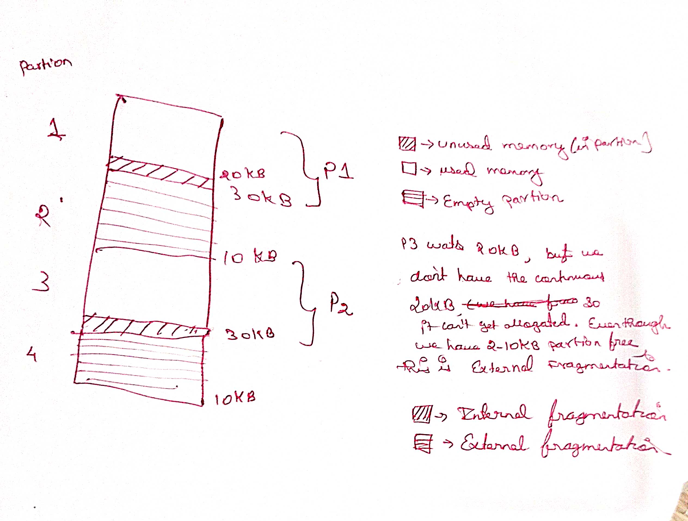

# Operating System

<sub>Scaler Free OS course [video](https://www.scaler.com/topics/course/free-operating-system-course/video/1343/), [text](https://www.scaler.com/topics/operating-system/)</sub>

-> Basics of Operating system

**What does OS do?**  
-> Manages resources( H/W & S/W )  
-> It provide convinence for use  
-> Exifficent use of all the resources  
-> Managing Process

**Process Managment**
* Scheduling
* IPC & Synchronisation
* Concurrency
* Deadlocks
* Threads


**Operating System**  
- Resource Manager ( ex: it handles mouse, keyboard, mouse, display, wifi, memory management.... etc... and softwares)  
- Modes of execution on a CPU  
    - user mode  
    - kernel mode  

**Architecture of CPU**  
[Von-numann and Hradvard Achitecture](https://www.geeksforgeeks.org/difference-between-von-neumann-and-harvard-architecture/)  
- Von-Neumann architecture ( stored Program )  
        All the program in memory  
- Harvard Architecture  


**Process**
* For every process there is a data structure Operating system maintains called Processs Status word (PSW), this data structure has one element called `mode-bit`, it defines wheter in user-mode(value will be 0 ) and kernel-mode(value will be 1)

# Scheduling Algorithm

## Process Management
* Process is a program under execution in RAM with resources allocated to it (program is Passive, process is active)

* Process in memory looks like this
```
        |---------------|
        | Runtime Stack |
        |---------------|
        | Dynamic       |  ( dynamic data is stored in head )
        |---------------|
        | Static        |  ( static data is stored in stack)
        |---------------|
        | Instruction   |
        |_______________|
```

* Operation on Process
    1. `create`    : Allocate resocures ( RAM, CPU, I/O ... )
    2. `schedule`  : sheduling CPU, I/O... etc, amoung various process, that are running in the computer
    3. `block`     : Blockage can be happen because of I/O call ( ex: waiting for the input )
    4. `suspend`   : i.e., if there is no space in ram, supending the non-critcal process and run the critical process
    5. `resume`    : Resume the suspended process
    6. `Terminate` : Terminating process

* Process Attributes:
    1. `process identification`   : Process Identification / ID ( PID ),
    2. `cpu related`              : i.e., Program Counter, ( tells the next instruction to execute ), General Purpose register, priority-states
    3. `memory related`           : Memory limits, page-tables,... etc
    4. `file related`             : file Ids, file access,... etc
    5. `I/O related`              : keyboard, mouse... etc
    6. `protection related`       : user-mode/kernel-mode, permissions... etc...

    All this attributes are stored in a table / data structure, called `Process Control Block` (`PCB`).

## Process-states


## Scheduling Queues
-> There are thousands of process running in the real world, we can manage them using scheduling queues.  

Scheduling queue   
- Ready Queue
- Block Queue
    - Device Queue
    - Event Queue
- Job Queue ( still a program waited to load into to memory )
- Suspend Queue

  

( PCB ( Process Control Block ) is the node in the queue)

**Three Types of schedulers**  
 * **Long Term Schedulers ( LTS )**: pick the approriate program and move to ready queue
 * **Medium Term Schedulers( MTS )**: pick a job to move from ready state to suspend
 * **Short Term Schedulers( STS )**: ( or cpu scheduler ) find a suitable process in ready queue and move it to CPU.


**I/O bound vs CPU bound processes:**  
- If the process is depends lot on CPU then it is a *CPU bound process*. ( ex: ML, AI, ... )  
- If the process depends more on IO and less depends on CPU, then it is *I/O bound process* ( ex: copying huge file... etc... )

### Dispatcher & Context-Switching:
1. Completion of a process -> PCB Corresponding to the process will be destroyed.
2. Then it wait for STS,
3. The pcb has the information of the registers of the process ( like PC, GPR,... etc...), STS copy all this to the correspoing CPU registers...
4. If the process requires I/O, then the current CPU values will be copyed to the PCB and but in the Block queue to wait for the input... and then cpu wait for the STS to process new process.
5. Preemption, ( if the higher priority process comes in, it all do same in the step 3 & 4, after completing the priorit process, other process will be processed )

## CPU Scheduling (STS) timings.

- The task of the STS is to pick which of the process in the ready queue should give control to CPU.
- It want to maximizing CPU utilization
- To do so, first we need to measure it first...

### Metrics used to measure CPU utilization
1. **Throughput:**  
    Number of processes completed per unit time.
    $$ Throughput = n/L $$
    where L is the [Schedule Length](#schedules)
2. **Arrival/Admission/Submission Time: (Ai or AT):**
    Time at process arrived at Ready Queue
3. **Wait time(WT):**
    - Types (CPU wait time, IO wait time)
    - STS only bouther about CPU wait time...
    - It tell/control how much time the process is waiting in the ready queue.
4. **Burst/service Time(BT or Xi):**  
    time for process in running state.
5. **Completeion Time(CT or Ci):**  
6. **I/O Burst wait time:**  
    wait time spent blocked on I/O
7. **Turn-Around Time (TAT):**  
    it is the completion time minus arrival time  
    $TAT = CT - AT$   or   $Ci - Ai$

    $$ Avg. TAT = \frac{1}{n} \sum_{i=1}^{n} ( C_i - A_i )$$  
    consider i as the process number. It will be the Avg. TAT of all the n process.  

    $$Weighted TAT = \frac{C_i - A_i}{x_i}$$
    Weighted TAT tells how much of the total time is spend on cpu by a particular process. ( Xi will be the burst time)

    $$Weight Time(WT) = C_i - A_i - X_i$$

    $$ Avg. WT = \frac{1}{n} \sum_{i=1}^{n} ( C_i - A_i - X_i )$$ 

8. **Response Time:**  
    The moment the Process commes to ready queue, it request the access of the CPU. Then the CPU response the process. Tike taken to get 1st response from CPU is known as the Response Time

9. **Scheduling Time:**  
    Time at which the process is scheduled first time

### Schedules
consider there is n process, which can be represented as
$p_n = \{ p_1, p_2,...,p_n \};$

Schedule is basically a squenc... Witch may in differe order,

There are n! ( n factorial ) sub-schedules are posible

**Number of Schedules = n!**

First we need to go trough n process to choose the first, next need to go through on ( n-1 ) process to pick second.... and so on... untill all the process got exicuted... so this gives the value n!.

**Schedule-Length = L = max(Ci) - min (Ai)**  
Schedule Length is the Total time to complete all processes in a schedule

### Deadline ( Di )
It's like defining deadline for the process before execution of process
- DeadLine Overrun ( if $C_i > D_i$ )
- DeadLine Underrun ( if $C_i < D_i$ )


## Predicting Burst Times:
1. **Using the Size of Process:**  
    Consider It knows 100kB process take 10sec, based on the preivious executions history
2. **Using Type of the Process:**  
    Example types: OS, GUI, Foreground, Background, Backup... etc..
3. **Averaging the previous CPU-Burst:**  
    Averaging the previous CPU-Burst of the same process Chunk..
    example:  
    ```
    P1 ->|WT|BT|WT|BT|WT|....
    you can see 1 process has multiple Wait time and Burst time, The average of this previous Burst Time will be the extimated new burst time.
    ```
    $\tau_n = \frac{1}{n-1}\sum_{i=1}^{n-1}t_i$  
    $\tau_n$ represent the estimated Burst Time. It is the simple average formula

    NOTE: t represent actual time burst, where $\tau$ represent the estimated Burst time  
4. **Exponential averaging / Ageing Algorithm:**
    It is simple modification of *Averaging the previous CPU-Burst*  
    $\tau_{n+1} = \alpha t_n + ( 1 - r )\tau_n, where 0<=\alpha<=1$

    NOTE: t represent actual time burst, where $\tau$ represent the estimated Burst time  


## Scheduling Algorithm ( STS or CPU Scheduling algo )
### First Come First Serve ( FCFS )
* Non-Premptive ( It switch to the other process only if it completes the current process )
* It assign the CPU based on AT ( arrival time )


### Shortest Job First ( SJF )
* Non-Premptive ( It switch to the other process only if it completes the current process )
* It assign the CPU based on the Burst Time
* It can run into starvation problem, where consider if the process has long burst time.... some time it will be ommitted till end. Becuase If newest coming job has the shortest Burst time
* Without the estimated Burst Time, we can't implement this algorithm




### Shortest Remaining TIME FIRST ( SRTF )
* Premptive ( It can run multiple process side by side, but one at a time )
* It is same as SJF but it is premitive
* It can run into starvation problem, where consider if the process has long burst time.... some time it will be ommitted till end. Becuase If newest coming job has the shortest Burst time
* Without the estimated Burst Time, we can't implement this algorithm


[Geek for Geeks Reference](https://www.geeksforgeeks.org/shortest-remaining-time-first-preemptive-sjf-scheduling-algorithm/)

### Longest Remaining Time First ( LRTF )
* It is similar to SRTF, instead of process the small BURST Time first, it will schedule Largest Burst time first...
* It will have lots of context switching
* Starvation is reduced....

[Geek for Geeks Reference](https://www.geeksforgeeks.org/longest-remaining-time-first-lrtf-cpu-scheduling-algorithm/)

### Highest Response Ratio Next ( HRRN )

$$Response Ratio = \frac{WT+BT}{BT}$$

Consider, If Wait Time increase for the BURST TIME, then response ratio will also increase...

* It is not-preemptive
* Its avoid starvation, because it consider WAIT TIME

[Geek for Geeks Reference](https://www.geeksforgeeks.org/highest-response-ratio-next-hrrn-cpu-scheduling/)

### Priority-based Scheduling ( PBS )
* It schedule process based on the priority number
* priority number can be static or dynamic...
* In Static, Starvation May occur..., We can solve this issue in dynamic type if we have process that waiting for long time, then we can change the priorit value to execute first...

### Round-Robin
* This is the Preemptive version of FCFS.
* It has Conscept called Time Quanta/Slice. So the every process are alowed to take CPU for the Particular time `Time Quanta/Slice`. After the round... it get the CPU for the same time and continues...


[Round-Robin](https://www.geeksforgeeks.org/program-for-round-robin-scheduling-for-the-same-arrival-time/)

Time Quanta should be calculated baseced on the requirement

### Multi-level-Queues algorithm
* It has multiple Ready Quesues... Each ready queues can use different scheduling algo...
* Problem of starvation can occur

### Multi-level-Feedback Queues
* this solves the starvation problem in Multi-level-qeues algorithm by time quantising the each redy queue similar to round robin
* this is combination of round-robin and multi-level queue
* starvation can happen, but lesser than mult-level-queue

### Longest Remaining 


## Inter Process communiation (IPC) in processa
Inter process communication is used to communicate between the two process

Types
1. Pipes
2. Shared Memory
3. Message Passing
4. Queue

Note: Intra-process communication is  communication done between functions in the single process ( global variable, passing value as a argument to the function is the way it done)

### Challanges
**Producer consumer problem** ( this is the synchronization problem )  
Producer-Consumer problem is a classical synchronization problem in the operating system. With the presence of more than one process and limited resources in the system the synchronization problem arises. If one resource is shared between more than one process at the same time then it can lead to data inconsistency. In the producer-consumer problem, the producer produces an item and the consumer consumes the item produced by the producer

[more here](https://www.scaler.com/topics/operating-system/producer-consumer-problem-in-os/)


**There are two types of synchronisation happen in the IPC**  
1. Cooperative ( ex: video streaming it should be synchronized in a way between of process p1 of placing the image in memory and process p2 of taking the image in a memory)
2. competitive ( ex: printer, if two process p1 and p2 try access the printer, only one can take control of printer at a time for that this synchronization is used)

### Necessary condition for synchronization problems
1. Critical Section ( CS )  
    <sup>Part of the program where shared resources are accessed</sup>
2. Race Condition  
    <sub>Processes must be racing/competing to access the shared resources(or critical section part)</sub>
3. Preemption  
    <sub>Preempting the process that access the critical section, and other process that access the critical section can cause the produce-consuber-problem</sub>

### Methods to Solve synchronization problems
**MUTUAL EXCLUSTION**  
This mechanism allows only one of the competing process can be in the Critical Section at any point of time. (other process need to wait until the other process completes its critical section code )

**Kinds....**
* A1. Mutual Exclusion with busy waiting ( means it uses the cpu for waiting (ex: while( isCricleResourceFree == 1); ) so the while loop will run in the cpu. It is useless execution right, at that time we may execute the some other process in the Ready queue)  
* A2. Mutual Exclusion without Busy Waiting ( means it doest not uses the CPU to wait for the critical resource )  
* B1. Hardware Mechanisum  
* B2. Software Mecanisum   
    * Kernel Level  
    * User Level  

### Condition for Sychronization Mechonisms
1. Gauranteed Mutual Exclusion
2. Progress  
    </sub>Processes in Non-critical section may not block other processes which want to enter CPU</sub>
3. Bounded waiting
    </sub>No process must wait forever to enter its Critical Section( secondary )</sub>
4. No assomption about Speed & CPUS
    <sub>Don't write for the particular processor or number processor or speed dependent. Make it General purpose OS</sub>

### Mechanism
<sub>[Geek for Geek tutorial detail link](https://www.geeksforgeeks.org/process-synchronization-set-2/)  </sub>      

#### 1. Disabling Interrupt Mechanism
It disables the interrupt before getting in to the critical section, no preemption will happen, it occupy the cpu until it executes the critical section code. Then it enable_interrupt, so other process can execute.


#### 2. Lock Variable Mechanism
1. Pure software mechanisum
2. It is Busy waiting ( means it uses the cpu for waiting (ex: while( isCricleResourceFree == 1); ) so the while loop will run in the cpu. It is useless execution right, at that time we may execute the some other process in the Ready queue )
3. It is working in user mode
4. This solution does not garante Mutual Exclusion, since it uses a sharaed variable named lock, to indicate wheter the critical section is occupied or not...

5. Advanced version of this idea is established in peterson algorithm for mutual exclusion, which solved all the issues in the Lock variable Mechanism

#### 3. Strict Alteration Mechanism / Turn Based Mechanisms
1. Pure software mechanisum
2. It is Busy waiting ( means it uses the cpu for waiting (ex: while( isCricleResourceFree == 1); ) so the while loop will run in the cpu. It is useless execution right, at that time we may execute the some other process in the Ready queue )
3. It is similar to shared variable lock it has turn. consider two process p1 and p2. p1 get into the Critical Section only when turn=1 and p2 get into CS only when turn=0. This is the difference between Lock variable mechanism, there lock is set to 1 when any one of the process is get into the CS.
4. Since the Exit section only changes turn it *garantees the mutual exclusion.* ( ADVICE-😁: only a simple change bring new posibilities)
5. Disadvantage: If you see the below image, it changes the turn=1 in the process p0. Suppose if there is another Critical section code is back in the p0, it can't access them because still turn=1. It will wait until p1 come into the critical section and change the turn=0. so that p0 2nd critical section will get execute. So it does not garantee progress
[strict-alteration-img](https://www.gatevidyalay.com/wp-content/uploads/2018/11/Turn-Variable-Synchronization-Mechanism.png)

#### 4. Peterson's Solution for Synchonization mechanism
1. It is software based, mutual exclusive, busy waiting and it ensure progress.
2. It uses two shared variable named `int turn` and `int flag[2] = { 0, 0 }`

3. Instruction in updating the shared variable ( turn and flag[a] ) should be automic and instant. we need it as only one machine level instruction to update...
4. The image shown above is fo 2processs, but there is version for multiprocess
5. It get into Deadlock, If it uses priority based scheduling. Consider two process p0 and p1 with priority 10 and 0, 0 is the highest priority task. consdier p0 is in the critical section, if p1 is come in ready queue, p0 is preemited from cpu and the cpu is given to the p1 ( since it has the highest priority ). now if p1 tries to access crictial section, it can't able to access it, since p0 own the crictical scection. so scheduler can't give access to the p0 to leave the critical section, because p1 is the highest priority. so the cpu stuck in the infinite loop ( p1 waits for the critical section infinitely ). This is know as Priority inversion problem
#### 5. Test and Set Lock (TSL) Mechanism 
1. It is Hardware 
    (it gives the instruction `TSL` a machine level instruction. Which do the job of two instruction in single instruction.  
    ex:  
        `TSL LOCK, R0` :It copyies the value of register R0 to Lock, and it make R0=1.  
        Then Critical section will get executed, after that, R0 is Made to 0. It is same as Lock variable wince it performs the 2task in the single instruction it give mutual exclusion)
2. It garantee Mutual Exclusion, It is busy waiting, And it is not Bonded waiting. Since it compete with multiple process, it does not know after the crictical section is free wheter its get in or not.


3. It get into Deadlock, If it uses priority based scheduling. Consider two process p0 and p1 with priority 10 and 0, 0 is the highest priority task. consdier p0 is in the critical section, if p1 is come in ready queue, p0 is preemited from cpu and the cpu is given to the p1 ( since it has the highest priority ). now if p1 tries to access crictial section, it can't able to access it, since p0 own the crictical scection. so scheduler can't give access to the p0 to leave the critical section, because p1 is the highest priority. so the cpu stuck in the infinite loop ( p1 waits for the critical section infinitely ). This is know as Priority inversion problem

#### 6. Sleep & Wakeup based synchronization
1. It solve's the busy waiting
2. It Does not garantee mutual exclusion
3. It uses the system all sleep() and wakeup(). consider two process p0, p1. suppose if p0 is in the Critical section and it got preempted, then p1 take the cpu, then it also tries to enter into the Critical section. Since p0 occupied the critical section, p1 execute the sleep() and leave the cpu by telling the scheduling algorithm, the p0 will get into the cpu, after completing the critical section it will wake up the p1. This how its work.
4. consider if process try to get into the Critical section at some what same time, at that time it does not garantee the critial section...
5. Dead lock also happen at some time both process get into sleep...


#### 7. Semaphores
1. It is the software resource
2. It store integer value ( You can consider the semaphore as a integer variable provided by OS Kernel. All operation, intcrementing (UP), decrementing (DOWN) this values are atomic ( _atomic operation_))
3. Its of 2 types
    * Counting ( integer Value )
    * Binary ( 0 0r 1 value)
4. Two Operation ( UP & DOWN  or Signal & Wait or V & P )

```c
// Binary semaphore
struct semaphore {
  
    enum value(0, 1);

    // q contains all Process Control Blocks (PCBs)
    // corresponding to processes got blocked
    // while performing down operation.
    Queue<process> q;

};
P(semaphore s)
{
    if (s.value == 1) {
        s.value = 0;
    }
    else {
        // add the process to the waiting queue
        q.push(P) sleep();
    }
}
V(semaphore s)
{
    if (s.q is empty) {
        s.value = 1;
    }
    else {

        // select a process from waiting queue
        Process p = q.front();
        // remove the process from waiting as it has been
        // sent for CS
        q.pop();
        wakeup(p);
    }
}

// This code is modified by Susobhan Akhuli
```

```c
// counting semaphore
struct Semaphore {

    int value;

    // q contains all Process Control Blocks(PCBs)
    // corresponding to processes got blocked
    // while performing down operation.
    Queue<process> q;

};
P(Semaphore s)
{
    s.value = s.value - 1;
    if (s.value < 0) {

        // add process to queue
        // here p is a process which is currently executing
        q.push(p);
        block();
    }
    else
        return;
}

V(Semaphore s)
{
    s.value = s.value + 1;
    if (s.value <= 0) {

        // remove process p from queue
        Process p = q.pop();
        wakeup(p);
    }
    else
        return;
}
```

[ geeks for geeks link ](https://www.geeksforgeeks.org/semaphores-in-process-synchronization/)

**Producer and consumer probrem using semaphores**
we need the 3 semaphore, to solve the producer and consumer problem.
1. counting Semaphore to track empty space ( buffer has space to put data )(checked by producer to place the data)
2. counting semaphore to track data availability in buffer ( this is done by the consumer )
3. Binary semaphore which helps to access the ctritical section only one at a time

```c
do{

//produce an item

wait(empty); // checks for empty spcae, if it available continue
wait(mutex); // binary semaphor, to manage the access of critical section  

//place in buffer ( critical section )

signal(mutex); //wake the other process that wait for critical section
signal(full); // tell the other process that i have added data in buffer

}while(true);
```

```c
do{
// consumer side
wait(full); // check for data availability in buffer, if no data available wait, else continue
wait(mutex); // binary semaphor, to manage the access of critical section

// consume item from buffer, critical section

signal(mutex);//wake the other process that wait for critical section
signal(empty); // tell the producer that i have consumed one data, now that space is free to put data..


}while(true);
```

[link for geeks for geeks](https://www.geeksforgeeks.org/producer-consumer-problem-using-semaphores-set-1/)


#### Reader and Writer problem
1. 1-Reader & 1-Writer ( it similar to producer consumer )
2. n-Reader & 1-writer ( here data can be accessed by n-readers at a time, but while writer writting only when all reader are finished reading only)
3, n-Reader & n-writer ( here data can be accessed by n-readers at a time, but while one writer writting only when all reader are finished reading and all other writer finished writing)

```c
do {
    // writer requests for critical section
    wait(wrt);  
   
    // performs the write

    // leaves the critical section
    signal(wrt);

} while(true);
```

```c
do {
    
   // Reader wants to enter the critical section
   wait(mutex);

   // The number of readers has now increased by 1
   readcnt++;                          

   // there is atleast one reader in the critical section
   // this ensure no writer can enter if there is even one reader
   // thus we give preference to readers here
   if (readcnt==1)     
      wait(wrt);                    

   // other readers can enter while this current reader is inside 
   // the critical section
   signal(mutex);                   

   // current reader performs reading here
   wait(mutex);   // a reader wants to leave

   readcnt--;

   // that is, no reader is left in the critical section,
   if (readcnt == 0) 
       signal(wrt);         // writers can enter

   signal(mutex); // reader leaves

} while(true);
```
[link](https://www.geeksforgeeks.org/readers-writers-problem-set-1-introduction-and-readers-preference-solution/)

#### Dining Philosopher's problem
**Scenario:**

Imagine several (usually five) philosophers sitting around a circular table.
Each philosopher alternates between two states: thinking and eating.
A large bowl of food (like spaghetti) is placed in the center, but each philosopher needs two chopsticks to eat (their left and right chopstick).
There's only one chopstick between each pair of philosophers.

**The Problem:**

The challenge is to design a system (or algorithm) that ensures:

* No two neighboring philosophers try to grab the same chopstick at once, leading to a fight.
* No philosopher gets stuck in a situation where they can never eat because their neighbors are always holding the chopsticks they need (deadlock).


[link](https://www.scaler.com/topics/operating-system/dining-philosophers-problem-in-os/)

### Concurrent Programming
now a days there are more the 1 cpu core in the processor, consider below example
```c
s=b+c; // Readset{ b, c}, writeset {s}
e=s+a; // ReadSet { s,c}, writeset{n}
```

if 1 line run in cpu core1 and 2nd line run in cpu core2, we get a wrong value store in e, since it depends on 1st write.

to solve this we need to identify it. run both the lines in the any one of the singe core.

#### Bernsteins condiions for concurrency

1) Readset(Si) n writeset(Sj) = $\empty$
2) Readset(Sj) n writeset(Si) = $\empty$
3) writeset(Si) n writeset(Sj) = $\empty$

n - means intersection

if it follow the above condition we can run the statements in multiple core, if it not then we should run in single core

#### Precidence graphy


here begin and end is like { , } braces
parabegin used to tell stat parallal execution for below statements.

disadvantage of parbegin and parend is wecant use it for cases like below, ( i.e, look s6 )

for like this case we use semaphore with in parabegin and paraend


#### Fork & Join Model of Concurrency



# Deadlocks and Threading in process

## Resource allogation graph (RAG)
simple version resource allocation graph is shown below


## Necessary conditions for deadlocks
Requires
1. Mutual Exclusion ( because it make the code wait until other processs free the resource )
2. Hold and wait 
3. No preemption ( here it means, process not allowed forcefully take control of the resource that is used by other process )
4. Circular Wait ( P1 require resource used by p2, similary p2->p3, p3->p1, (This forms circular wait))

this is only for general condition, some methods include the above condition and avoid deadlock.

## Deadlock handeling
**strategies...**
1. ignoring the deadlock
2. Detect & recover
3. Prevention and avoidance

### Ignoring dead lock
1. called as ostrich algorithm ( ostrich burry there head under the sand when sand strom)
2. eventually process will start again, due to long time... ( may be like watch dog timer for process )

### Prevention
1.ex.: Dead lock can be prepented by using !( hold & wait ). if lets say process p1 holding resource R1, it want resource R2 also, which is controlled by p2 and p2 wants resource R1. Now p1 need to wait for resource R2 right, suppose before waiting for the resource R2, if p1 free the resource R1 and then start waiting for the resource R2 the deadlock can be avoided write.
2. any process are not allowed to HOLD and WAIT the resources at the same time, can prevent deadlock.
3. starvation occurs in  all prevention
**Methods:**
1. Request all the resource at even start of the process
    1. It is inefficient
2. Release all resources before requesting new resources
3. forcefully take resource from other process, maybe based on priority
4. self realisation, in this case process know that other process want the resource that this process hold, knows deadlead happend and give the resource itself
5. prevention of cicular wait
    * Here each resource is asigned with uinque id
    * to avoid the circular wait process Pi can only reqest resource with id greater than other resources holded by the process Pi.
    * ex, Resource id holded by Pi are 1,2 ,5,8,9
    * suppose if Pi want to acces the resource with id 6, it need to free all the resources greater than resource id 6 and then need to access it

### Avoidance 
#### Banker Algorithm
**Data Structures:**

**Max**: A matrix representing the maximum resource each process might need.
**Allocation**: A matrix showing the resources currently allocated to each process.
**Need**: A matrix calculated as Max - Allocation, representing the remaining resource needs of each process.
**Available**: A vector representing available units of each resource type.

**Safe State Check:**
The algorithm checks if the system is in a safe state, meaning it can finish all processes without encountering a deadlock. It simulates a scenario where processes finish one by one, releasing their allocated resources back to the Available vector.

**Process Completion Simulation:**

A process Pi is eligible to finish if its Need vector is less than or equal to the Available vector.
If Pi is eligible, its allocated resources are released back to Available, and Pi is marked as finished.
The Available vector is updated to reflect the released resources.
This simulation continues until all processes are finished, or a deadlock is detected (no process is eligible).

**Granting Requests:**
When a process requests additional resources, the Banker's algorithm checks if granting the request would leave the system in a safe state. It performs the simulation mentioned above considering the requested resources being allocated to the process.

**Limitation**
Sure. The Banker's algorithm is great for preventing deadlocks, but it has some downsides. It requires a fixed number of processes and resources, and processes need to know their maximum needs in advance, which can be tricky. It can also be computationally expensive for many processes and resources.

### Detection and recovery
#### Detection
Detects Deadlock based on
1. low utilization of cpu, ( or majority of processes are blocked )
2. using Resource Allocation Graph, we can detect the wait-for-graph and we can found cycles in it  ( only for single instance resource only )

3. it uses the banker alogirthm like mechanism, but without the MAX matrix, it detect the safe state based on allogated resource, requesting resource and currently available resource

#### Recovery
types
1. Process termination
    1. kill all ( DISADVANTAGE: utilize more cp )
    2. kill one at a time ( only kill the last process that caused dead lock. if the dead lock is continued, then it kill the next last process, continues )
2. Resource preemption (Force process to give up resource)
    1. Roll-Back ( it forcefully remove the resource in all process, that was asked last time)  
        ex: Before rool Back  
            P1-> 1 -> 4 -> 5  
            P2-> 2 -> 3 -> 6  
        after on roll back it forcefully remove 11 resource  
            P1-> 1 -> 4   
            P2-> 2 -> 3 
        it can also roll back two stage back

## Multi Threading Introduction
MultiThreading Vs MultiTasking ( using fork )
1. code and sharing memory is same in multithreading
2. better CPU utilisation in multithreading
3. Easier access to shared data in multithreading
4. multithreading is faster in context switch
5. multithreading gives more control &ease

 

### Threads Types
1. USER thread ( os does not know the thread, it only look it as a single process,  )
2. KERNEL thread ( here OS knows about threads (increase efficiency), but switching via kernel is expensive )
3. HYBRID thread

# Memory Management
Loader ( load the program to memory )
    * Static loading ( int stack, whole program including other function function also takes memory )
    * Dynamic loading (stack will be created when function is called )

Linking ( BInding the address of called function into the calling function machine level code)
* Static linking ( create one big ML code, including all function )
* Dynamic linking ( it uses symbol table to link in runtime)


## Object
1. minimize wastage of memory / better utilization of memory
2. Increase degree of multi-taskinga

## Functions
1. Memory allocation
2. Memory deallocation
3. Managing Free-space
4. Protection

## Memory Managing Models
1. Contigous ( continuous )
    1. overlays
    2. partitioning
    3. Buddy system
2. Non-Contigous ( non continuous )
    1. paging
    2. segmentation
    3. segmented paging
    4. virtal memory & demand paging


### Overlays
Overlay driver go through the source code, and constructing the tree of dependency. And finds the modules that are independent from one other. and using this it can able to utilize the RAM better.



[link](https://www.geeksforgeeks.org/overlays-in-memory-management/)

overal cannot be applied in some program which may not in a proper structure...

### Partioning 
Types  
1. Fixed Partition ( MFT )
2. Variable Partition ( MVT )

Each process should present in only one partition, to avoid the confusing with the variable name of the two process
#### Fixed Partition
* Maximum number of partition number = maximum number of process  
* Fixed Partition find, which available partition should we place a new process  
* Protection ( It allow only to access the memory within the given partion, using the MIN and MAX of the partion.)


#### Performance of MFT / Fixed Partition
1. Fragmentation
    * Wastage of Memory
    * Internal Fragmentation
    
    * Externel Fragmentation: ( is an inability to place a process with in main memory, because all the free non internal fragmented space is contigous )
    
2. Degree or maximum number of multiprogramming ( processes ) are fixed based on the number of partions
3. Process size limitation, ( we cannot allocate the process with has more memory than the partition size)


#### Partition Allocation Methods
* **First-fit** (place the process in first empty partition)
* **Best-Fit** ( it find the partion size closest to the process size, so the unused memory is reduced)
    * **Best fit** only ( process is waits for the best partition, until the partition get freed from other process)
    * **Best available fit** ( if the partition found is not free, find the next best fit)
* **Next-Fit** ( next fit is similar to the first fit, but it start looking for the partion, from the previous allogated partition. It has time advantage )
* **Worst-fit** ( wastage is maximal )
# Other Titles
- Fork()
- Symbol Table is used to tell the function or variable address in the OS.
# Glossory
1. **Preemptive vs Non- Preemptive ( or atomic execution )**  
    Preemptive OS can kill the process, or program, where on Non-preemptive it will not able to kill the process ( process had to leave from it side )
