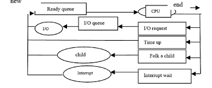
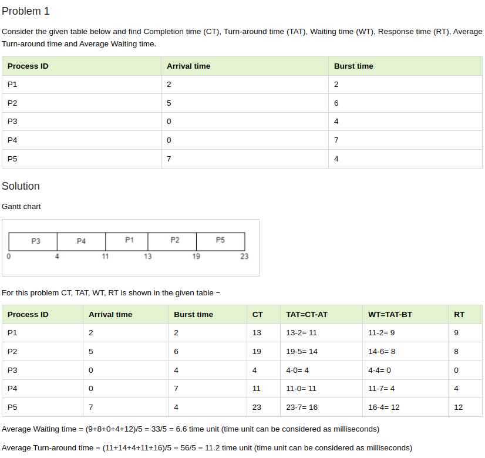
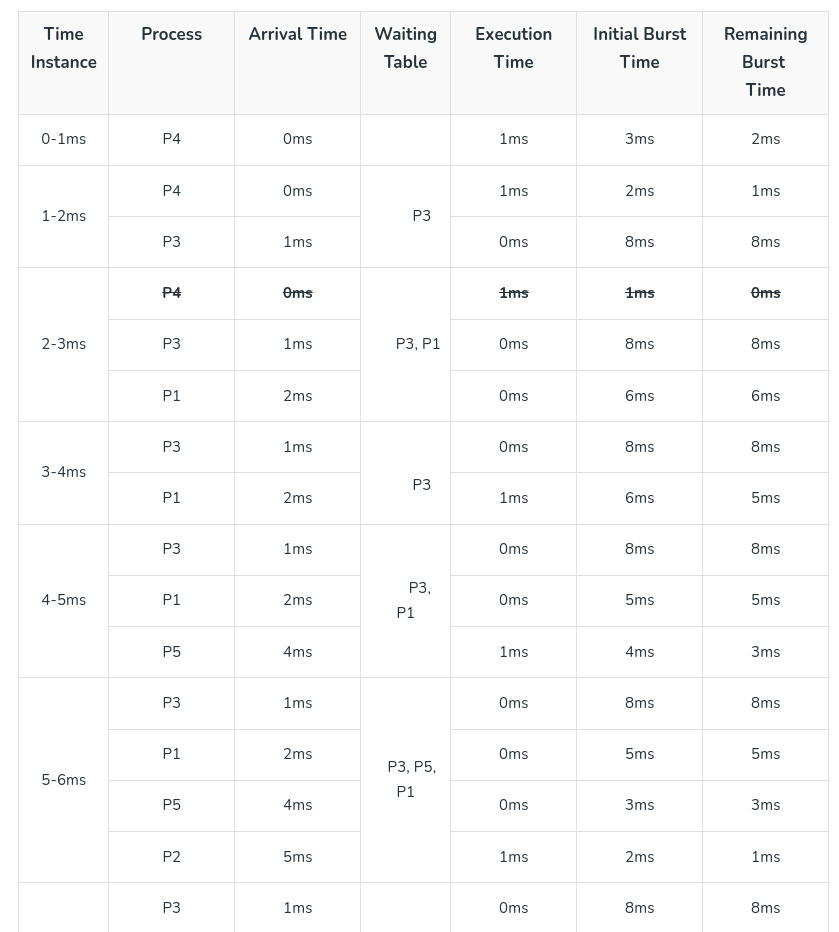
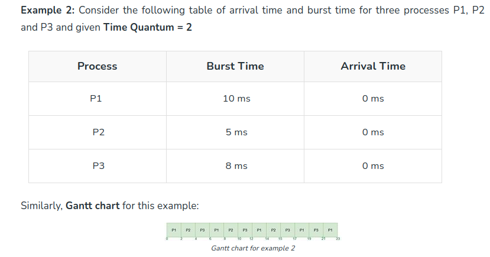

# Operating System

<sub>Scaler Free OS course [video](https://www.scaler.com/topics/course/free-operating-system-course/video/1343/), [text](https://www.scaler.com/topics/operating-system/)</sub>

-> Basics of Operating system

**What does OS do?**  
-> Manages resources( H/W & S/W )  
-> It provide convinence for use  
-> Exifficent use of all the resources  
-> Managing Process

**Process Managment**
* Scheduling
* IPC & Synchronisation
* Concurrency
* Deadlocks
* Threads


**Operating System**  
- Resource Manager ( ex: it handles mouse, keyboard, mouse, display, wifi, memory management.... etc... and softwares)  
- Modes of execution on a CPU  
    - user mode  
    - kernel mode  

**Architecture of CPU**  
[Von-numann and Hradvard Achitecture](https://www.geeksforgeeks.org/difference-between-von-neumann-and-harvard-architecture/)  
- Von-Neumann architecture ( stored Program )  
        All the program in memory  
- Harvard Architecture  


**Process**
* For every process there is a data structure Operating system maintains called Processs Status word (PSW), this data structure has one element called `mode-bit`, it defines wheter in user-mode(value will be 0 ) and kernel-mode(value will be 1)

# Scheduling Algorithm

## Process Management
* Process is a program under execution in RAM with resources allocated to it (program is Passive, process is active)

* Process in memory looks like this
```
        |---------------|
        | Runtime Stack |
        |---------------|
        | Dynamic       |  ( dynamic data is stored in head )
        |---------------|
        | Static        |  ( static data is stored in stack)
        |---------------|
        | Instruction   |
        |_______________|
```

* Operation on Process
    1. `create`    : Allocate resocures ( RAM, CPU, I/O ... )
    2. `schedule`  : sheduling CPU, I/O... etc, amoung various process, that are running in the computer
    3. `block`     : Blockage can be happen because of I/O call ( ex: waiting for the input )
    4. `suspend`   : i.e., if there is no space in ram, supending the non-critcal process and run the critical process
    5. `resume`    : Resume the suspended process
    6. `Terminate` : Terminating process

* Process Attributes:
    1. `process identification`   : Process Identification / ID ( PID ),
    2. `cpu related`              : i.e., Program Counter, ( tells the next instruction to execute ), General Purpose register, priority-states
    3. `memory related`           : Memory limits, page-tables,... etc
    4. `file related`             : file Ids, file access,... etc
    5. `I/O related`              : keyboard, mouse... etc
    6. `protection related`       : user-mode/kernel-mode, permissions... etc...

    All this attributes are stored in a table / data structure, called `Process Control Block` (`PCB`).

## Process-states


## Scheduling Queues
-> There are thousands of process running in the real world, we can manage them using scheduling queues.  

Scheduling queue   
- Ready Queue
- Block Queue
    - Device Queue
    - Event Queue
- Job Queue ( still a program waited to load into to memory )
- Suspend Queue

  

( PCB ( Process Control Block ) is the node in the queue)

**Three Types of schedulers**  
 * **Long Term Schedulers ( LTS )**: pick the approriate program and move to ready queue
 * **Medium Term Schedulers( MTS )**: pick a job to move from ready state to suspend
 * **Short Term Schedulers( STS )**: ( or cpu scheduler ) find a suitable process in ready queue and move it to CPU.


**I/O bound vs CPU bound processes:**  
- If the process is depends lot on CPU then it is a *CPU bound process*. ( ex: ML, AI, ... )  
- If the process depends more on IO and less depends on CPU, then it is *I/O bound process* ( ex: copying huge file... etc... )

### Dispatcher & Context-Switching:
1. Completion of a process -> PCB Corresponding to the process will be destroyed.
2. Then it wait for STS,
3. The pcb has the information of the registers of the process ( like PC, GPR,... etc...), STS copy all this to the correspoing CPU registers...
4. If the process requires I/O, then the current CPU values will be copyed to the PCB and but in the Block queue to wait for the input... and then cpu wait for the STS to process new process.
5. Preemption, ( if the higher priority process comes in, it all do same in the step 3 & 4, after completing the priorit process, other process will be processed )

## CPU Scheduling (STS) timings.

- The task of the STS is to pick which of the process in the ready queue should give control to CPU.
- It want to maximizing CPU utilization
- To do so, first we need to measure it first...

### Metrics used to measure CPU utilization
1. **Throughput:**  
    Number of processes completed per unit time.
    $$ Throughput = n/L $$
    where L is the [Schedule Length](#schedules)
2. **Arrival/Admission/Submission Time: (Ai or AT):**
    Time at process arrived at Ready Queue
3. **Wait time(WT):**
    - Types (CPU wait time, IO wait time)
    - STS only bouther about CPU wait time...
    - It tell/control how much time the process is waiting in the ready queue.
4. **Burst/service Time(BT or Xi):**  
    time for process in running state.
5. **Completeion Time(CT or Ci):**  
6. **I/O Burst wait time:**  
    wait time spent blocked on I/O
7. **Turn-Around Time (TAT):**  
    it is the completion time minus arrival time  
    $TAT = CT - AT$   or   $Ci - Ai$

    $$ Avg. TAT = \frac{1}{n} \sum_{i=1}^{n} ( C_i - A_i )$$  
    consider i as the process number. It will be the Avg. TAT of all the n process.  

    $$Weighted TAT = \frac{C_i - A_i}{x_i}$$
    Weighted TAT tells how much of the total time is spend on cpu by a particular process. ( Xi will be the burst time)

    $$Weight Time(WT) = C_i - A_i - X_i$$

    $$ Avg. WT = \frac{1}{n} \sum_{i=1}^{n} ( C_i - A_i - X_i )$$ 

8. **Response Time:**  
    The moment the Process commes to ready queue, it request the access of the CPU. Then the CPU response the process. Tike taken to get 1st response from CPU is known as the Response Time

9. **Scheduling Time:**  
    Time at which the process is scheduled first time

### Schedules
consider there is n process, which can be represented as
$p_n = \{ p_1, p_2,...,p_n \};$

Schedule is basically a squenc... Witch may in differe order,

There are n! ( n factorial ) sub-schedules are posible

**Number of Schedules = n!**

First we need to go trough n process to choose the first, next need to go through on ( n-1 ) process to pick second.... and so on... untill all the process got exicuted... so this gives the value n!.

**Schedule-Length = L = max(Ci) - min (Ai)**  
Schedule Length is the Total time to complete all processes in a schedule

### Deadline ( Di )
It's like defining deadline for the process before execution of process
- DeadLine Overrun ( if $C_i > D_i$ )
- DeadLine Underrun ( if $C_i < D_i$ )


## Predicting Burst Times:
1. **Using the Size of Process:**  
    Consider It knows 100kB process take 10sec, based on the preivious executions history
2. **Using Type of the Process:**  
    Example types: OS, GUI, Foreground, Background, Backup... etc..
3. **Averaging the previous CPU-Burst:**  
    Averaging the previous CPU-Burst of the same process Chunk..
    example:  
    ```
    P1 ->|WT|BT|WT|BT|WT|....
    you can see 1 process has multiple Wait time and Burst time, The average of this previous Burst Time will be the extimated new burst time.
    ```
    $\tau_n = \frac{1}{n-1}\sum_{i=1}^{n-1}t_i$  
    $\tau_n$ represent the estimated Burst Time. It is the simple average formula

    NOTE: t represent actual time burst, where $\tau$ represent the estimated Burst time  
4. **Exponential averaging / Ageing Algorithm:**
    It is simple modification of *Averaging the previous CPU-Burst*  
    $\tau_{n+1} = \alpha t_n + ( 1 - r )\tau_n, where 0<=\alpha<=1$

    NOTE: t represent actual time burst, where $\tau$ represent the estimated Burst time  


## Scheduling Algorithm ( STS or CPU Scheduling algo )
### First Come First Serve ( FCFS )
* Non-Premptive ( It switch to the other process only if it completes the current process )
* It assign the CPU based on AT ( arrival time )



### Shortest Job First ( SJF )
* Non-Premptive ( It switch to the other process only if it completes the current process )
* It assign the CPU based on the Burst Time
* It can run into starvation problem, where consider if the process has long burst time.... some time it will be ommitted till end. Becuase If newest coming job has the shortest Burst time
* Without the estimated Burst Time, we can't implement this algorithm


### Shortest Remaining TIME FIRST ( SRTF )
* Premptive ( It can run multiple process side by side, but one at a time )
* It is same as SJF but it is premitive
* It can run into starvation problem, where consider if the process has long burst time.... some time it will be ommitted till end. Becuase If newest coming job has the shortest Burst time
* Without the estimated Burst Time, we can't implement this algorithm



[Geek for Geeks Reference](https://www.geeksforgeeks.org/shortest-remaining-time-first-preemptive-sjf-scheduling-algorithm/)

### Longest Remaining Time First ( LRTF )
* It is similar to SRTF, instead of process the small BURST Time first, it will schedule Largest Burst time first...
* It will have lots of context switching
* Starvation is reduced....

[Geek for Geeks Reference](https://www.geeksforgeeks.org/longest-remaining-time-first-lrtf-cpu-scheduling-algorithm/)

### Highest Response Ratio Next ( HRRN )

$$Response Ratio = \frac{WT+BT}{BT}$$

Consider, If Wait Time increase for the BURST TIME, then response ratio will also increase...

* It is not-preemptive
* Its avoid starvation, because it consider WAIT TIME

[Geek for Geeks Reference](https://www.geeksforgeeks.org/highest-response-ratio-next-hrrn-cpu-scheduling/)

### Priority-based Scheduling ( PBS )
* It schedule process based on the priority number
* priority number can be static or dynamic...
* In Static, Starvation May occur..., We can solve this issue in dynamic type if we have process that waiting for long time, then we can change the priorit value to execute first...

### Round-Robin
* This is the Preemptive version of FCFS.
* It has Conscept called Time Quanta/Slice. So the every process are alowed to take CPU for the Particular time `Time Quanta/Slice`. After the round... it get the CPU for the same time and continues...



[Round-Robin](https://www.geeksforgeeks.org/program-for-round-robin-scheduling-for-the-same-arrival-time/)

Time Quanta should be calculated baseced on the requirement

### Multi-level-Queues algorithm
* It has multiple Ready Quesues... Each ready queues can use different scheduling algo...
* Problem of starvation can occur

### Multi-level-Feedback Queues
* this solves the starvation problem in Multi-level-qeues algorithm by time quantising the each redy queue similar to round robin
* this is combination of round-robin and multi-level queue
* starvation can happen, but lesser than mult-level-queue

### Longest Remaining 
# Other Titles
- Fork()

# Glossory
1. **Preemptive vs Non- Preemptive ( or atomic execution )**  
    Preemptive OS can kill the process, or program, where on Non-preemptive it will not able to kill the process ( process had to leave from it side )