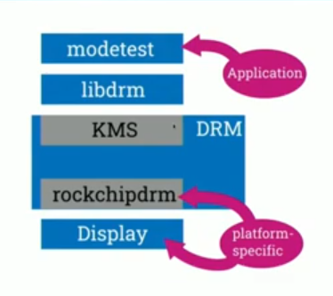
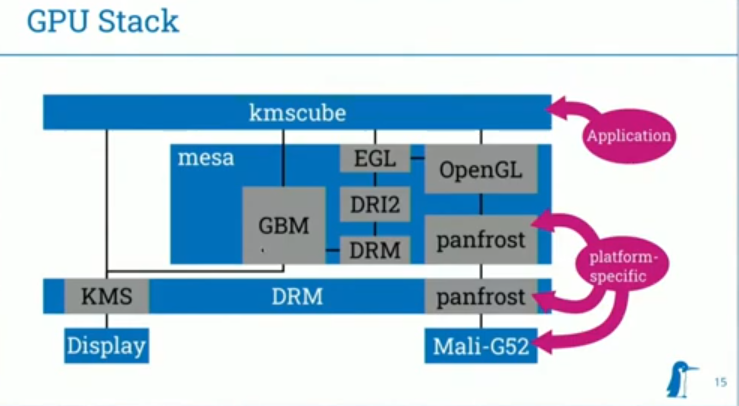
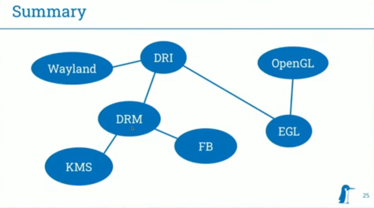
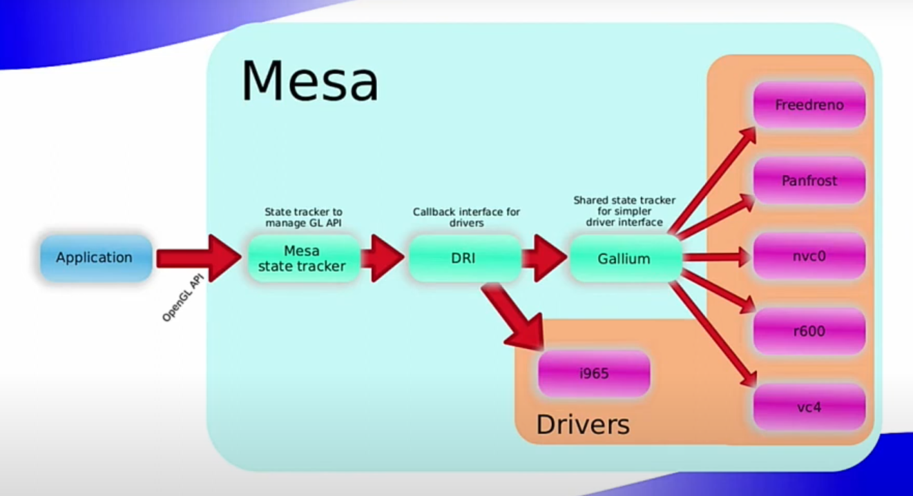
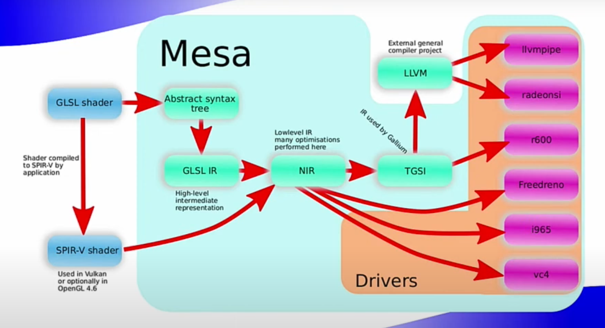
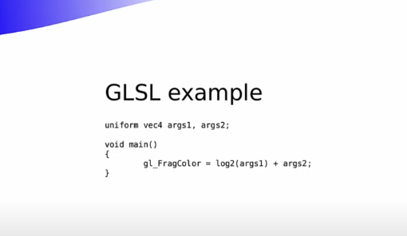
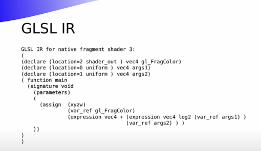
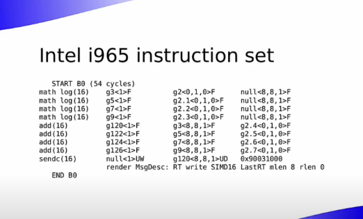

# Question 

Depmod ( dependancy modlues )
Modprobe ( same as insmod, but it automatically load the dependency also)( -r is used to remove )

Copy_to_user, copy_from_user

Nxp Downstream kernel vs mainline kernel

Upstream ( original kernel )
Downstream ( kernel modified by distributions, etc.. )
It mention the flow, if there is any bug in distribution, it can be go upward, if it originate from original kernel. And downstream kernel is the modified version of original kernel ( down flow )

BSS, data, rom size of the binary

operating clock frequency of MCU and DRIVER

mcu internel clock 16MHZ, and 48MHZ for USB
mcu I2C speed 400khz

Driver pixel clock 186.5MHZ
MIPI driver clock frequency 24MHZ

what is elf?


GMSL


Rootfs architecture

OpenGL

Nvcsi,vi, dtb, 

(Read about all the basics, and what you do stuff, porting stuff, camera,... Etc...) 

Western display, xorg, DRM direct rendering manager

Qmmf, adb... Etc

systemd services, TTY...

WHat is systemctl?

**How laptop chooses dtb, while there are numerous laptop work**
How Laptops Manage Hardware Diversity:

**ACPI (Advanced Configuration and Power Interface):**

Provides a standardized mechanism for operating systems to discover and configure hardware components.
Contains information about devices, power management, and other system-level details.
The kernel uses ACPI to dynamically detect and configure hardware at boot time.

**Modular Kernel:**

The Linux kernel is modular, allowing it to load and unload drivers for different hardware components as needed.
This flexibility enables the kernel to adapt to various hardware configurations.

**Firmware (UEFI):**

Stores basic system information and configuration data.
Provides a platform-independent interface for operating systems.
OS-Specific Configuration:

Operating systems like Ubuntu use configuration files and tools (e.g., xorg.conf) to further customize hardware settings.

https://unix.stackexchange.com/questions/399619/why-do-embedded-systems-need-device-tree-while-pcs-dont


Differnce between dp, dsi port..

THIS MODULE usage in driver.


EGL, Context, Surface, and Display
EGL
EGL (Embedded Graphics Library) is an interface that bridges the gap between graphics APIs like OpenGL ES and the underlying native platform window system. It handles tasks like:
 * Context management: Creating and managing OpenGL ES contexts.
 * Surface binding: Connecting OpenGL ES with surfaces where rendering occurs.
 * Synchronization: Ensuring proper synchronization between the graphics API and the display.
Display
A display represents a physical output device like a screen or monitor. In EGL, it's the connection point to the underlying graphics system. Think of it as the overall canvas where you'll be drawing.
Surface
A surface is a region where you can render graphics. It can be associated with a window, a texture, or an off-screen buffer. EGL uses surfaces to define the target for OpenGL ES rendering.
Context
A context is a state machine for OpenGL ES. It holds rendering state, including shaders, textures, and other resources. You create a context for a specific display and bind it to a surface to start rendering.
Relationship between them:
 * You create an EGL display to connect to the underlying graphics system.
 * You create a surface to define the area where you'll render.
 * You create a context to hold the rendering state.
 * You bind the context to the surface to start rendering on the display.
Visual analogy:
 * Display: The entire canvas or screen.
 * Surface: A specific area on the canvas where you'll paint.
 * Context: Your set of brushes and colors.
 * EGL: The easel that holds everything together.
Key points to remember:
 * A display can have multiple surfaces.
 * Multiple contexts can share the same surface.
 * Only one context can be current at a time.
Additional notes:
 * EGL is not Android-specific, though it's commonly used on Android.
 * There are different types of surfaces (window surfaces, pixel buffers, etc.) depending on the use case.
 * EGL provides mechanisms for creating and managing contexts efficiently.
Would you like to delve deeper into a specific aspect, such as creating an EGL context or using surfaces in Android development?


ftrace in linux kernel 
odldefconfig

## IPC ( inter process communication )
(video : https://www.youtube.com/watch?v=Fb4UoqXPEtI&list=PPSV )


## Interesting
Dynamic debug in Linux
Unit testting
Linux display driver

## Working of Linux Graphic stack
( tutorial Source: https://youtu.be/WaF7mVhnhtE?si=1hrPBBWSkuuR5IMf )  

**generel steps:**
1. Bring a pixel Buffer onto the display
2. Draw pixels into a pixel buffer
3. compose multiple pixel buffers

### Bring a pixel Buffer onto the display



here drm is the kernel part,  ( rockchipdrm specifies the drm for th rock chip 3a board specific drm) ( platform dependent)

libdrm is the library for userspace to talk to kernel space drm

modetest ( is the sample test application for display) ( like v4l2ctl may consider.... )
sudo apt install libdrm-tests


modetest will output like in the above manners
(try to run the modetest command and see)

( see this page for more understanding for KMS https://www.kernel.org/doc/html/v4.15/gpu/drm-kms.html )


Lots of Info. on KMS and other look in to it:https://wiki.st.com/stm32mpu/wiki/DRM_KMS_overview

**Encoders:** ( Need to understand)  
**connectors:** ( Need to understand) ( connector information)  
**CRTC:** ( moreinteresting part from a software perspective are the CRTC's. It is an abstraction for the display controller itself. Display controller may compose a different planes and build the final buffer that's sent to the display. we need to configure the crtc to build the buffer thats sent out.) ( timing is also feature of CRTC ) ( need to understand )  
**planes:** ( need to understand )  ( as a final step to actually put data there you have to allocate the FrameBuffer (FB) with the FPS, and in configuration we need to tell our display controller to take this framebuffer put it in this plane and show it )
**EDID:** Extended Display Identification Data (EDID) and Enhanced EDID (E-EDID) are metadata formats for display devices to describe their capabilities to a video source (e.g., graphics card or set-top box). The data format is defined by a standard published by the Video Electronics Standards Association  

**kernel Debugging**
``` bash
ls /sys/class/drm/card0-HDMI-A-1
ls /sys/kernel/debu/dri/0
echo 0x1ff > /sys/module/drm/parameters/debug  # 0x1ff means enabled all flags in the debugging
```

### Draw Pixels into a pixel buffers
( if we execute in CPU it will take a lot of time, copy frame also slow in CPU. So GPU can be used )

OpenGL - Open Graphics Library  
GLSL   - OpenGL shading Language
EGL    - Native platfrom graphics interface API 

#### GPU STACK



The above image is a Rock chip 3a GPU stack.... ( you can see the hardware specific this here )


example application: `kmscube` ( read as "kms cube" ), is an simple a application 

which is used to access kms and use OpenGL to render something, we can use environmental variable while launching the kmscube, to debug in the mesa... etc... ( you can also use environmental variable for platform specific ) ( look in internet for the details of the environmental variable )


### Compose Multiple Pixel Buffers

* only a single application may use display -> DRM master
* Toolkits and applications ( often ) don't support KMS
* we need a window compositor

Thats where wayland comes in as a window compositor


wayland client and compositor interacte with each other using wayland Protocol

Implementation of Wayland compositor  
Reference implementation:
*  weston uses Wayland compositor
* GNOME uses Mutter compositor
* KDE uses Kwin
* sway, cage uses wlroots

Mutter, Kwin, wlroots are the implementation of the way land compositor


**Debugging Wayland**
* weston --debug
* weston-debug backend-drm

* wayland-info ( client applicion to check info like which protocol/version is supported... etc )
* WAYLAND_DEBUG=1 simple-egl
* weston-debug proto




### Acronyms
1. DRI - Direct Rendering Infrastructure
2. DRM - Direct Rendering Manager ( part of DRI ) ( It's both GPU and Display )
3. KMS - Kernel Mode Setting ( part of DRM, like configuration ) ( it is for display control, like turning color to electorns may be..)
4. FB  - Frame Buffer ( or Pixel Buffer )


## Graphics: A Frames Journey
https://www.youtube.com/watch?v=nau2dgdXWOk 

### GEM ( Graphics Execution Manager )
* Does not manage any execution , just memory
* GEM buffer object ( BO ) is a ust collection of raw butes
* can be used for pixel buffers, vertex/compute data, firmware....
* NO metadata attached to the BO itself
* No generic BO-allocation API due to hardware divergence

### KMS dumb buffers,
* `Dump buffers` in KMS allows very limited generic userspace
* Generic ioctl to allocate BO fro CPU rendering & KMS display
* Returns a GEM BO you can mmap to fill with lovely pixels
* wrap these in a kms framebuffer: annotates BO with width, height, pixel format, etc
* Used for splash screens, software-onlu compositors, etc...
* dont use it for other this

### DRM/KMS runtime use
* collect input BOs and attach them to frame buffers
* Attach framebuffers to planes with optional crop
* position planes within CRTC with optional scale
* set any other CRTC/connector-wide parameters
* commit everything, hope it works
* wait for completetion event
* schedule next repaint based on completioon time + frequency
### Resources
* https://dri.freedesktop.org/docs/drm/gpu/
* https://gitlab.freedesktop.org/daniels/kms-quads

### Wayland Resources
* https://git.sr.ht/~kennylevinsen/wlhax


## A Current Overview of the DRM KMS Driver Side APIs,
slides: https://bootlin.com/pub/conferences/2023/eoss/kocialkowski-current-overview-drm-kms-driver-side-apis/kocialkowski-current-overview-drm-kms-driver-side-apis.pdf


▶ **Framebuffer:** Memory buffer(s) with pixel data
▶ **Plane:** Pixel mixing (rotation, scaling, format and more), layers. If we have different framebuffer, how would they show on the screen is defined here. 
▶ CRTC: Timings generation and pixel streaming
▶ Encoder: Interface physical adaptation (protocol, signals). It captures the pixel that are correctly time and translate to the physical encapsulation for the display interface (ex: for HDMI physcial encapsulation is TMDS ). it take the pixel and ecoded it for hdmi say an example.
▶ Bridge: Interface transcoding
▶ Panel: Display surface emitting/reflecting light
▶ Monitor: Peripheral integrating a panel
 
**Typical hardware components:**  
▶ Display controller in (PCIe) graphics card (x86) or as unit in SoC (embedded)  
▶ On-board and internal bridge(s)  
▶ Display connector(s), always-connected panel(s)
**Memory cases:**  
▶ Dedicated memory in graphics card (video RAM)  
▶ Shared memory with the system  
      With IOMMU: general system pages, scatter-gather  
      Without IOMMU: reserved contiguous memory  
▶ CPU access and cache management:  
      Automatic with cache-coherent interconnect  
      Manual cache invalidate/flush or cache disabled otherwise  

Linux userspace APIs for display:
▶ fbdev interface: deprecated
• Simple uAPI with pre-allocated memory
• Very limited use-cases and configuration
• Bad performance (no zero-copy)
• No new drivers, will be removed eventually
▶ DRM KMS/DRM mode uAPI:
• Proper pipeline configuration (planes, CRTC, connector)
• Well-balanced abstraction of hardware complexity
• DRM Atomic uAPI
• DRM GEM/TTM memory management
• DRM Prime for dma-buf zero-copy
• DRM Sync Object for fences
• Various drivers for graphics cards and embedded

### Memory manager
**Translation Table Manager (TTM) memory manager:**
• Historic memory manager for DRM, big and complex
• Supports both shared system memory and dedicated video memory,
used by graphics card drivers
**Graphics Execution Manager (GEM) memory manager:**
• New design from Intel, focused on sharing code
• Only supports shared system memory, used by most embedded drivers
• Provides struct drm_driver fops and callbacks with DEFINE_DRM_GEM_FOPS and
DRM_GEM_DMA_DRIVER_OPS
• Supports driver-specific dumb_create operation with
DRM_GEM_DMA_DRIVER_OPS_WITH_DUMB_CREATE
• Allocates write-combined DMA buffers with dma_alloc_wc()
contiguous or not depending on IOMMU presence, coherent
• Also supports non-coherent (requires explicit sync)
• Helper to get framebuffer DMA address: drm_fb_dma_get_gem_addr()

Kernel hardware components:
▶ Drivers registered from bus infrastructure:
• pci bus for graphics cards
• platform bus for SoC units
• i2c, spi, etc for bridges and panels
• platform or mipi_dsi for panels

▶ Drivers register components to DRM KMS framework:
• struct drm_device, for display controllers
• struct drm_bridge, for bridges (internal or external)
• struct drm_panel, for panels

▶ Drivers need to identify eachother:
• Represent pipeline topology
• Retrieve remote component structures for API use
• Static description via device-tree graph with port/endpoint (or ACPI)
• Node nesting for bus (DSI)


▶ Translation Table ManDRM, KMS, Mesaager (TTM) memory manager:
• Historic memory manager for DRM, big and complex
• Supports both shared system memory and dedicated video memory,
used by graphics card drivers

▶ Graphics Execution Manager (GEM) memory manager:
• New design from Intel, focused on sharing code
• Only supports shared system memory, used by most embedded drivers
• Provides struct drm_driver fops and callbacks with DEFINE_DRM_GEM_FOPS and
DRM_GEM_DMA_DRIVER_OPS
• Supports driver-specific dumb_create operation with
DRM_GEM_DMA_DRIVER_OPS_WITH_DUMB_CREATE
• Allocates write-combined DMA buffers with dma_alloc_wc()
contiguous or not depending on IOMMU presence, coherent
• Also supports non-coherent (requires explicit sync)
• Helper to get framebuffer DMA address: drm_fb_dma_get_gem_addr()


## In openGL how to share the texture to other library or process?
using EGL Image we can do that


* https://blaztinn.gitlab.io/post/dmabuf-texture-sharing/

* https://eleni.mutantstargoat.com/hikiko/egl-dma-1/

* https://github.com/sabipeople/tegra/blob/master/tegra_multimedia_api/samples/common/classes/NvEglRenderer.cpp

* https://github.com/sabipeople/tegra/blob/master/tegra_multimedia_api/argus/samples/utils/PreviewConsumer.cpp

* https://github.com/raspberrypi/userland/blob/master/host_applications/linux/apps/raspicam/gl_scenes/vcsm_square.c


IN LAP Implementation try

https://github.com/Fredrum/rpi_v4l2_tests/blob/master/glDmaTexture.c

https://forums.raspberrypi.com/viewtopic.php?t=314547

**DMA BUFFER METHOD FD**
https://github.com/emfend/dmabuf-v4l2-demo/blob/main/dmabuf-v4l2.c#L380

## Embedded Graphics Drivers in Mesa
https://www.youtube.com/watch?v=sgMCWbenjds&list=WL&index=6&t=37s


Mesa does the work of translating the ( openGL or Vulkan ) API call in to the system call to talk to the kernel driver, the part in the kernel will handle allocating the actual memory in the graphics memory, or programming the registers in the GPU, 


History of OpenGL - 


Mesa drivers ( GPU ) for all  
Ex:  
  Intel ( i965, i915, anv )  
  AMD (radv, radeonsi, r600)  
  NVIDIA ( nouveau )  
  Qualcomm ( freedreno )




( in the above diagram for i9565 callbacks are handled directly may be mesa developer is intel, othere drivers uses gallium an extra layer )

* Mesa has a loader that selects the driver by asking for the vendor id, chip id... from the kernel driver
* There is a map of PCI ids and user-space mesa drivers.
* When it is found, mesa loads the respective driver and sees if the driver succeds
* In case of failure the loader tries sofware renderes.
* It is possible to force software renderer
   * LIBGL_ALWAYS_SOFTWARE=1



Abstract Syntax Tree: tree in memory representation of shader

GLSL IR: ( high level tree )

IN NIR IR: there is no loger a tree it will be the sequence of instruction set

Example, gpu compile codes at each step ( image it as a c compiling stages )








( in braket 16 tells that, do that each operation 16 time simulatniously or parallely )

## DMA-BUF Heaps: Linux User-space Device Buffer Allocation and its uses

## NEW QUESTION

* What is DMA buffer?
   -  /dev/umdabuf ( https://github.com/ikwzm/udmabuf )
   - find more

* why even inserting the one camera 2 video nodes are created in /dev?

* what is ION?

* What is VBO, VAO, VEO